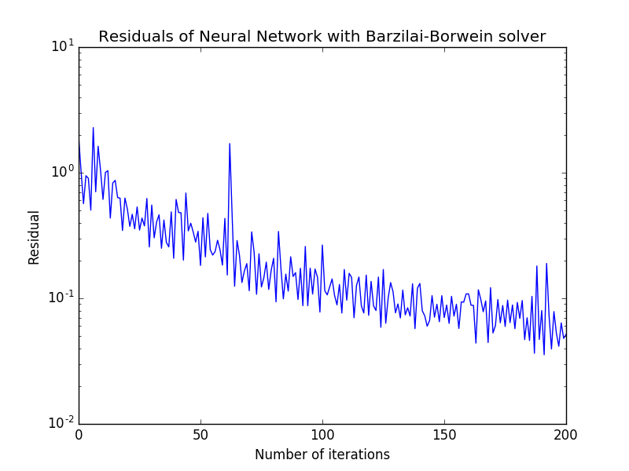

<h1 align=center> Vanilla Neural Network Using Python </h1>
<p align="center">
<a href="https://travis-ci.org/karanvivekbhargava/vanilla-neural-network">

</a>
<!-- <p align="center">

Reference for image: <a href='http://www.savioke.com/'>link</a> -->
</p>

## Project Overview

This is an implementation of an optimized neural network using python. Various optimization methods have been used in conjunction to make the network converge faster. Sigmoid non-linearities have been sandwiched between the layers. The final loss function has been chosen as the softmax layer. The neural network is very flexible and can be used with different number of layers.

## Dependencies

This project uses the following:
* python 2.7
* numpy - for matrix manupulations
* sklearn - to load data
* matplotlib - to visualize the loss

To install them kindly enter the following on the terminal
```
pip install numpy
pip install sklearn
pip install matplotlib
```

## How to build demo - standard install via command-line
```
git clone --recursive https://github.com/karanvivekbhargava/vanilla-neural-network.git
cd <path to repository>
python main.py
```

## Example

The neural network class example is given below

```
# Instantiate neural network object
nn = Net()
# Pre-process data
x_train, y_train, x_valid, y_valid, x_test, y_test = readData()
# Feed data into neural network
nn.feedData(x_train, y_train, x_valid, y_valid, x_test, y_test)
# Add the layers
nn.addLayer(50)
nn.addLayer(40)
nn.addLayer(30)
nn.addLayer(20)
nn.addLayer(y_train.shape[1])
# Start the NN solver
nn.solver()
```
The `Net()` initializes the net object. After this, the data needs to be fed into the network by using the `feedData` method. We can freely add layers of all dimensions using `addLayer` method.

The `readData` function reads the iris dataset and normalizes the data so that the neural network converges faster.

<p align="center">

</p>

## Results

Sample output:

<p align="center">

</p>

Terminal output:
```
Training Accuracy =  98.0952380952
Test Accuracy =  96.7741935484
```
